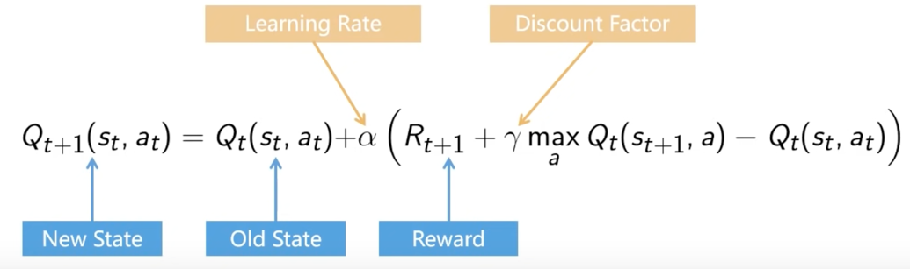
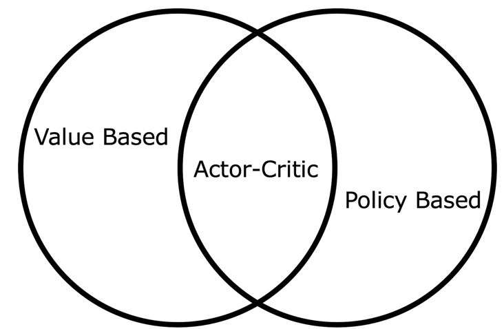

### Goal of Reinforcement Learning

Maximize the expected cumulative reward -> $\max \mathbb{E}[\sum_{t=0}^T r_t]$

### Notations

- $A_t$ -> action at time $t$
- $S_t$ -> state at time $t$
- $R_t$ -> reward at time $t$
- $G_t$ -> return at time $t$
- $\pi(s)$ -> policy
- $\pi(s)$ -> action $a$ taken in state $s$ under policy $\pi$
- $\pi(a|s)$ -> probability of taking action $a$ in state $s$ under policy $\pi$

### Value Function V(s)

The value function represents the expected cumulative reward (also called return) that an agent will receive from a
certain state $s$. In other words, it tells how good it is to be in a particular state.

$V(s) = \mathbb{E}[\sum_{t=0}^\infty \gamma^t R_{t+1} | S_0 = s]$

$v_{\pi}(s) = \mathbb{E}_{\pi}[G_t|S_t=s]$

### Action-Value Function Q(s, a)

This function, also called the **Q-function**, represents the expected cumulative reward starting from a state $s$,
taking action $a$, and then following a policy. It tells how good it is to take action $a$ in state $s$.

$Q(s, a) = \mathbb{E}[\sum_{t=0}^\infty \gamma^t R_{t+1} | S_0 = s, A_0 = a]$

### Policy $\pi$(a,s)
A policy is a mapping from states to probabilities of selecting each possible action. It defines the agent's behavior.
There are two types of policies:
- **Deterministic policy**: Always selects the same action for a given state.
- **Stochastic policy**: Chooses actions according to a probability distribution over actions given a state.
  The goal of RL is to find the optimal policy $\pi^* $, which maximizes the cumulative reward.

### Off-policy vs. On-policy
#### On-policy
On-policy methods solve the exploration vs exploitation dilemma by including randomness in the form of a policy. Thus, it selects non-greedy actions with some probability.
#### Off-policy
Uses two policies: the target policy that is being learned and the behavior policy that is used to select actions. The behavior policy can be deterministic or stochastic, and it can be unrelated to the target policy.

### Exploration vs. Exploitation
- **Exploration**: Trying new actions to discover their effects.
- **Exploitation**: Choosing actions that are known to yield high rewards based on the current knowledge.

### Model-based vs. Model-free
- **Model-based**: Learns a model of the environment (transition probabilities and rewards) and uses it to plan ahead.
- **Model-free**: Directly learns the value function or policy without a model of the environment.
---

### Markov Decision Process (MDP)

- Only the current state matters
- The future state is independent of the past states
- The environment is fully observable
- The environment is deterministic
- The environment is episodic
- The environment is finite
- Environment consists of states
- An action can be taken at each state
- The action will give reward and new state

-----
### Monte Carlo Methods
Estimate value functions by averaging the results of many random samples (trajectories) from an environment.
Value estimates are updated after an entire **episode** is completed.

Monte Carlo methods estimate the value function $V(s)$ or action-value function $Q(s,a)$ by averaging the returns (cumulative rewards) obtained after visiting a state $s$ or taking an action $a$.

**Key Features**:

- Learning from episodes: MC methods wait until an episode is over before calculating the return and updating value estimates. This works well in episodic tasks where the agent reaches a terminal state.

- Sample-based: They rely on sample episodes from actual experience in the environment, rather than requiring a full model of state transitions and rewards.

- Exploration requirement: To get a good estimate of the value function, the agent needs to explore the environment adequately (visit all relevant states and actions).

### Policy Iteration
    Used to find optimal policies in MDPs.

Policy iteration alternates between two main steps:

- Policy Evaluation: Given a policy $π$, estimate the value function $Vπ$ that describes the expected return starting from each state and following $π$.
- Policy Improvement: Use the value function VπVπ to improve the policy. The new policy $π$ is determined by acting greedily with respect to the current value function, meaning that in each state, the agent chooses the action that maximizes the expected return.

### Temporal Difference Learning
TD learning allows an agent to update value estimates not only based on the reward at the end of an episode (like in Monte Carlo methods) but after every step, using the reward observed and the estimate of the next state’s value.

### SARSA
On-policy algorithm that uses $\epsilon$-greedy strategy
SARSA (State-Action-Reward-State-Action) is used to learn an optimal policy for a Markov Decision Process (MDP) through direct interaction with the environment.

SARSA works by updating the action-value function \( Q(s, a) \) using the following update rule:
$Q(s, a) \leftarrow Q(s, a) + \alpha \left[ r + \gamma Q(s', a') - Q(s, a) \right]$

### Q-Learning
Q-learning is an off-policy TD control algorithm that learns the optimal action-value function $Q^*(s, a)$ by directly approximating it.
In the beginning you don't know the estimate of the Q-value, so you initialize it and then you take actions and observe the reward and the next state. You update the Q-value using the formula:
$Q_{t+1} (s_t, a_t) \leftarrow Q_t(s_t, a_t) + \alpha \left[ R_{t+1} + \gamma \max_ {a'} Q_t(s_t, a) - Q_t(s_t, a_t) \right]$

(for that use the Bellman equation)

You learn the Q-value for each state-action pair by taking actions and observing the rewards and next states. The agent uses an $\epsilon$-greedy strategy to balance exploration and exploitation.

Deternmine between exploration and exploitation using $\epsilon$-greedy strategy

### Deep Q-Learning

### Policy Based Methods

#### REINFORCE

#### Baseline

### Types of RL 

| Type           | **Model-based**                          | **Value-based**                     | **Policy-based**                        | **Actor-Critic**                        |
|----------------|------------------------------------------|-------------------------------------|-----------------------------------------|--------------------------------------------|
| **Approach**   | Uses a model of the environment to simulate actions and outcomes. | Learns a value function to evaluate the goodness of actions or states. | Directly optimizes the policy to maximize expected reward. | Combines value-based and policy-based methods. |
| **Key Method** | Planning (e.g., Value Iteration, Monte Carlo Tree Search). | Q-learning, SARSA, DQN (Deep Q-networks). | Policy Gradient methods (e.g., REINFORCE, PPO, TRPO). | Combines value function and policy optimization (e.g., A2C, A3C). |
| **Exploration**| Can simulate actions to explore, reducing real-world interaction. | Typically uses exploration policies like \(\epsilon\)-greedy. | Exploration can be stochastic through policy. | Balances exploration and exploitation through actor and critic. |
| **Strengths**  | Efficient for environments where models are available or easy to learn. | Simple to implement, works well in many environments. | Works well in environments with continuous actions or policies. | Combines value-based and policy-based methods. |
| **Weaknesses** | Requires an accurate model; may be computationally expensive. | May struggle with continuous or large action spaces. | May converge to local optima; high variance in learning. | May require careful tuning of hyperparameters. |
| **Examples**    | Model Predictive Control, Dyna-Q.         | Q-learning, DQN, SARSA.            | REINFORCE, PPO, TRPO.                   | A2C, A3C.                                |
### Actor-Critic Methods

